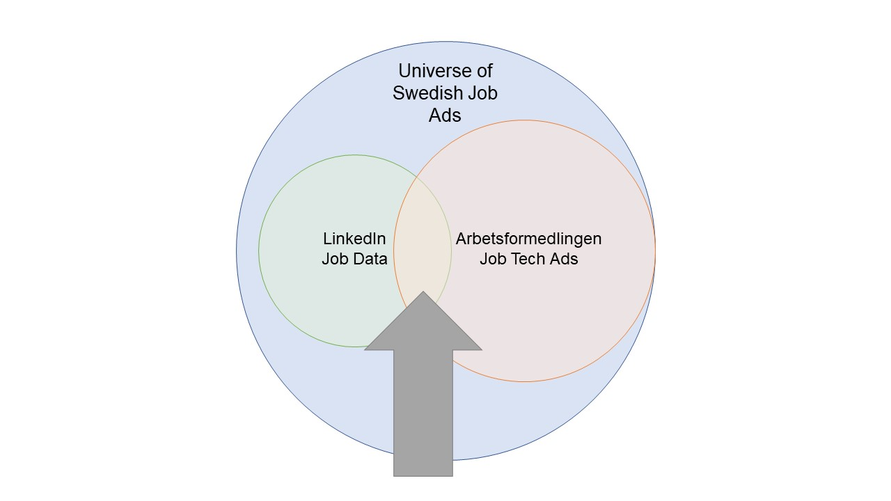

```{r setup, include=FALSE}
knitr::opts_chunk$set(echo = F, message = F, warning = F, fig.align = "center")
```


```{r}
library(tidyverse)
library(knitr)
library(reactable)
theme_set(theme_light())
```

# What extent of the Swedish labour market do Arbetsformedling's job ads cover?

We want to know whether the job ads on Arbetsformedlingen's Platsbanken are representative of the entire Swedish labour market.

One way to establish this we can look at another source of job data in Sweden and compare the contents of these adverts.

```{r, fig.cap="Overlap in job data"}

```


## Data sources

We will use data from the social networking site [LinkedIn](https://www.linkedin.com/). There are two sources of information that we will examine, the first is focussed on Sweden specifically, while the second is aggregated data from all of the countries in which LinkedIn operates. The first source is called the [LinkedIn Jobs on the Rise 2022 Report](https://www.linkedin.com/pulse/linkedin-jobs-rise-2022-10-roles-growing-demand-sweden-/) covering the 10 roles that are growing in demand in Sweden.

## Jobs on the Rise

This report measures the job titles "experiencing the highest growth rates from January 2017 through July 2021". It also provides information about the people who fill these jobs with these titles currently, based on the infomation on LinkedIn.

### What are the fastest growing jobs?

The report states that these 10 are the fastest growing jobs in Sweden.

```{r}
df <- read_rds("data/jobs_on_the_rise.rds")


df %>%
  select(rank, title) %>%
  reactable::reactable(
    defaultColDef = colDef(headerStyle = list(background = "#f7f7f8")),
    columns = list(
      title = colDef(name = "Title"),
      rank = colDef(name = "Rank", maxWidth = 100)
    ),
    bordered = TRUE,
    highlight = TRUE
  )
```


### What are skills for these jobs?

The table below shows the top skills for these jobs as recorded on LinkedIn. It is worth noting that language skills do not appear in any of these occupations. Perhaps it is widely understood that these jobs require a command of both Swedish and English.

```{r}
df %>%
  select(rank, title, most_common_skills) %>%
  separate_rows(most_common_skills, sep = ",") %>%
  mutate(most_common_skills = str_squish(most_common_skills)) %>%
  group_by(title) %>%
  mutate(rn = str_c("Skill_", row_number())) %>%
  ungroup() %>%
  pivot_wider(names_from = rn, values_from = most_common_skills) %>% 
  reactable::reactable(
      # height = 500,
      defaultPageSize = 10,
    defaultColDef = colDef(
      header = function(value) gsub("_", " ", value, fixed = TRUE),
      cell = function(value) format(value, nsmall = 1),
      align = "left",
      minWidth = 70,
      headerStyle = list(background = "#f7f7f8")
    ),
    columns = list(
      title = colDef(name = "Title", minWidth = 140,
                     align = "left"),
      rank = colDef(name = "Rank", maxWidth = 80, format = colFormat(digits = 1))
    ),
    bordered = TRUE,
    highlight = TRUE
  )
```

The lack of language skills might also be a function of the way that the top skills are identified. The methodology section of the Jobs on the Rise report is not very informative about how the top skills are mined, but in the methodlogy section of the LinkedIn and Worlbank data which we look to next, it states that: 

<blockquote>

[Industry skills] are calculated using an adapted version of a text mining technique called Term Frequency - Inverse Document Frequency (TF-IDF). This method gives more weight to a skill for an industry if more members in the industry list the skill on their profiles and the skill is more unique to the industry.

</blockquote>

Source: ["World Bank LinkedIn Digital Data for Development" by World Bank Group & LinkedIn Corporation](https://linkedindata.worldbank.org/data)

In other words, if the skills "English" and "Swedish" appear as skills across many jobs, these terms will not occur in the top skills for these 10 fastest growing jobs because they are not *specific* to these jobs.

In order to better compare the LinkedIn data on Sweden and the Arbetsformedlingen data, it might be worth replicating the process to find the fastest growing job vacancies in Arbetsformedlingen's data and looking at the skills most specific to these jobs.

## What else can we learn from the Jobs on the Rise data?

### What share of these jobs are filled by women?

Mouse over the figure below to see exactly what share of jobs are filled by men and women amongst Sweden's fastest growing jobs according to the Jobs on the Rise report.

```{r}
library(ggtext)
library(ggiraph)

g <- df %>%
  select(title, current_gender_distribution) %>%
  separate(current_gender_distribution, into = c("Female", "Male"), sep = "\\;|,") %>%
  mutate(across(c("Female", "Male"), parse_number)) %>%
  mutate(title = fct_reorder(title, Female)) %>%
  pivot_longer(-title) %>%
    mutate(tooltip = str_c(name, " ", value, "%")) %>% 
  ggplot(aes(value, title, fill = name, tooltip = tooltip)) +
  geom_col_interactive() +
  scale_x_continuous(labels = scales::percent_format(scale = 1)) +
  scale_fill_manual(
    name = NULL,
    values = c(Female = "#0072B2", Male = "#009E73"),
    labels = c(
      Female = "<p style='color:#0072B2'>Female</p>",
      Male = "<p style='color:#009E73'>Male</p>"
    )
  ) +
  labs(
    x = "Gender split in job",
    y = NULL,
    fill = NULL,
    title = "**LinkedIn Jobs on the Rise**  
    <span style='font-size:11pt'>Gender split for 
    <span style='color:#009E73;'>**males**</span> and
    <span style='color:#0072B2;'>**females**</span> by job
    </span>"
  ) +
  theme(
    plot.title = element_markdown(lineheight = 1.1),
    legend.text = element_markdown(size = 11),
    legend.position = "none"
  )

ggiraph(ggobj = g)

```


### Experience and remote share {.tabset}

The Jobs on the Rise report also includes information on the attributes of the incumbents in these roles. It includes the median years of experience listed on LinkedIn, as well as the share of jobs which are done remotely.

#### Experience

What is the distribution of experience by job?

```{r}
h <- df %>%
  mutate(title = fct_reorder(title, experience),
         tooltip = str_c("Median experience: ", experience)) %>% 
  ggplot(aes(x = experience, title, tooltip = tooltip)) +
  geom_segment(aes(xend = 0, yend = title)) +
  geom_point_interactive(cex = 4, colour = "darkred") +
  labs(x = "Median years of experience",
       y = NULL,
       title = "Median years of experience by job",
       caption = "Source: LinkedIn Jobs on the Rise 2022")

ggiraph(ggobj = h)
```

We can see that there is a large jump in median years of experience from the second most, Digital Managers (8.7), to Software Account Executives (14.4). In addition, Machine Learning Engineers have the fewest years of experience (3.5).

#### Remote share

What is the share of jobs done remotely?

```{r}
i <- df %>%
  mutate(title = fct_reorder(title, remote_job_availability),
         tooltip = str_c("Share of remote jobs: ", remote_job_availability*100, "%")) %>%
  ggplot(aes(remote_job_availability, title, tooltip = tooltip)) +
  geom_segment(aes(xend = 0, yend = title)) +
  geom_point_interactive(cex = 4, colour = "Orange") +
  scale_x_continuous(labels = scales::percent_format()) +
  labs(
    x = "Percentage of jobs available as remote",
    y = NULL,
    title = "Share of jobs which are remote",
    caption = "Source: LinkedIn Jobs on the Rise 2022"
  )

ggiraph(ggobj = i)
```

It is interesting that Software Account Executives both have the greatest number of years of experience and th largest share of jobs that are conducted remotely. The next panel explores the correlation across these 10 fastest growing jobs.

Career Counsellors are almost exclusively in-person jobs, perhaps due to the nature of their work.

#### Correlation

Is there a relationship between median experience and remote share?

```{r, fig.height=4.5}
library(ggrepel)

k <- df %>% 
    mutate(rank = factor(rank),
           tooltip = str_c("Median experience: ", experience, "<br>Share of remote jobs: ", remote_job_availability*100, "%")) %>% 
    ggplot(aes(experience, remote_job_availability, tooltip = tooltip)) +
    geom_smooth_interactive(aes(experience, remote_job_availability), method = "lm", se = F) +
    geom_point_interactive(aes(colour = rank), cex = 4) +
    geom_text_repel(aes(label = title), vjust = .5) +
    scale_color_viridis_d(direction = -1) +
    scale_y_continuous(labels = scales::percent_format()) +
    expand_limits(x = 0, y = 0) +
    labs(x = "Median number of years of experience",
         y = "Percentage of jobs available as remote",
         colour = "Rank in Jobs\non the Rise")

ggiraph(ggobj = k)
```

What about a linear regression?

```{r}
library(gtsummary)

mod1 <- df %>% 
    lm(formula = remote_job_availability ~ experience, data = .) 

mod1 %>% 
    tbl_regression() %>% 
    add_significance_stars()
```

Wow! There is a really poor fit!

### Where are these rising jobs located?

The report also lists the three top hiring locations for these rising jobs. The list is dominated by Sweden's three largest cities: Stockholm, Gothenburg and Malmö. Aside from these, Uppsala, Täby and Lund appear on the list.

Click on a bubble to see the jobs for which the city is amongst the three top hiring locations.

```{r}
library(leaflet)

map_locations_tabs <- read_rds("data/jobs_on_the_rise_map.rds")

pal <- colorNumeric(
  palette = "Spectral",
  domain = map_locations_tabs$n,
  reverse = T
)

map_locations_tabs %>%
  leaflet(width = 800, height = 500) %>%
  setView(
    lng = 14.1618,
    lat = 57.7826,
    zoom = 6
  ) %>%
  addProviderTiles("CartoDB.Positron") %>%
  addCircleMarkers(
    lat = ~lat,
    lng = ~long,
    radius = ~ n * 3,
    popup = ~html,
    color = ~ pal(n)
  ) %>%
  addLegend("bottomright",
    pal = pal, values = ~n,
    title = "Number of the top 10<br>rising jobs in location:",
    labFormat = labelFormat(),
    opacity = 1
  )
```


### Transitions

We can also see job titles that the incumbents in these 10 fast growing jobs held prior to their current roles. These are shown in the table below.

```{r}
df %>% 
    select(rank, title, top_roles_transitioned_from) %>% 
      reactable::reactable(
      # height = 500,
      defaultPageSize = 10,
    defaultColDef = colDef(
      header = function(value) gsub("_", " ", value, fixed = TRUE) %>% str_to_title(),
      cell = function(value) format(value, nsmall = 1),
      align = "left",
      minWidth = 70,
      headerStyle = list(background = "#f7f7f8")
    ),
    columns = list(
      title = colDef(minWidth = 50),
      rank = colDef(maxWidth = 80)
    ),
    bordered = TRUE,
    highlight = TRUE
  )
```


### Methodology

The methodology section of the report states that:

<blockquote>

LinkedIn Economic Graph researchers examined millions of jobs started by LinkedIn members from 1 January 2017 to 31 July 2021 to calculate a growth rate for each job title. To be ranked, a job title needed to see consistent growth across our membership base, as well as have grown to a meaningful size by 2021. Identical job titles across different seniority levels were grouped and ranked together. Internships, volunteer positions, interim roles and student roles were excluded, and jobs where hiring was dominated by a small handful of companies in each country were also excluded.

</blockquote>


## LinkedIn World Bank data

Source description:

The purpose of including this source is to better understand what part of the labour market is captured by LinkedIn. It is my supposition that the upper end of the income distribtuion is in jobs found on LinkedIn - but I could be very wrong! The two country level measures provided in the LinkedIn World Bank data 

### Who goes where?

Talent migration is one of the features captured in the data released by LinkedIn and the World Bank.

```{r}
df <- read_rds("skilled-migration/df.rds")

library(ggiraph)

df_mig <- df %>% 
    filter(base_country_name == "Sweden") %>% 
    mutate(sign = if_else(net_per_10K_total > 0, "Net sending countries", "Net recieving countries")) %>% 
    group_by(sign) %>% 
    mutate(rank = rank(desc((net_per_10K_total)^2))) %>% 
    ungroup() %>%
    filter(rank <= 8) %>% 
    select(- net_per_10K_total) %>% 
    pivot_longer(net_per_10K_2015:net_per_10K_2019, names_to = "metric") %>% 
    mutate(year = parse_number(str_remove(metric, "net_per_10K_")))

g <- df_mig %>% 
    mutate(tooltip = str_c(target_country_name, " ", value)) %>% 
    ggplot(aes(year, value, colour = target_country_name, tooltip = tooltip, group = target_country_name)) +
    geom_point_interactive(cex = 4) +
    geom_line() +
    facet_wrap(~ sign, nrow = 1) +
    scale_color_brewer(palette = "Paired") +
    geom_hline(yintercept = 0, lty = 2) +
    theme(legend.position = "bottom") +
    labs(x = "Year",
         y = "Net migration",
         colour = NULL)

ggiraph(ggobj = g)
```


```{r}

df_emp <- read_rds("data/df_emp.rds")

# function to make the plots
plot_employment <- function(section) {
  l <- df_emp %>%
    filter(isic_section_name == section) %>%
    mutate(
      sign = avg_growth_rate > 0,
      industry_name = fct_reorder(industry_name, avg_growth_rate),
      tooltip = str_c(round(avg_growth_rate, 4) * 100, "%")
    ) %>%
    ggplot(aes(avg_growth_rate, industry_name, fill = sign, tooltip = tooltip)) +
    geom_col_interactive() +
    scale_x_continuous(labels = scales::percent_format(accuracy = .1)) +
    scale_fill_manual(values = c("#D29C9C", "#92B87A")) +
    theme(legend.position = "none") +
    labs(
      x = paste0("Average growth rate in employment in\n", section, "\nJan 2017 - December 2019"),
      y = NULL
    )

  ggiraph(ggobj = l)
}


# function to make the tabs
make_tab <- function(section) {
  section_short <- word(section, 1) %>% str_remove(., "[:punct:]")

  cat("###", section_short)
  cat("\n")
  cat("Plot of employment growth in ", "<b>", section, "</b>")
  cat("\n")
  p <- plot_employment(section)
  print(htmltools::tagList(p))
  cat("\n")
}

```

## What has happenned to employment growth in Sweden? {.tabset}

Mouse over the columns to see the rate of employment growth between 2017 and 2019 in Sweden.

```{r, results='asis'}

section_list <- unique(df_emp$isic_section_name) %>% as.character()
# make the tabs for each island that is there
for (i in section_list){

  make_tab(i)

}

```


```{r}

```


## Have a look at this data for yourself!

```{r}
knitr::include_url("https://linkedindata.worldbank.org/data")
```


Definitions:

<blockquote>

The Industry Skills Needs metric captures which skills are most likely to be added to a member's profile in one industry compared to other industries. It's calculated using an adapted version of a text mining technique called Term Frequency - Inverse Document Frequency (TF-IDF). This method gives more weight to a skill for an industry if more members in the industry list the skill on their profiles and the skill is more unique to the industry. The skills included are those added while a member holds a particular occupation (the skill flow approach). While the skill flow approach creates a trade-off whereby long-held basic skills, such as Microsoft Office being given a lesser weight, the approach is shown to be stronger at identifying the latest emerging skills in a specific industry than including all historical skills that are added during prior occupations. On balance, since the objective of this metric is to detect the latest skills needs, a skill flow approach is adopted.

</blockquote>


